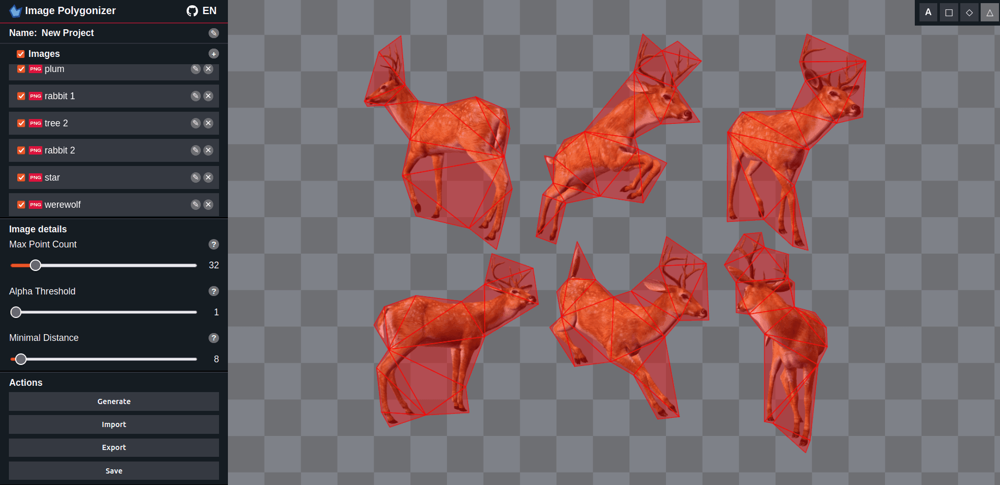

# Image Polygonizer



**Image Polygonizer**: A browser-based tool for converting PNG/WebP sprite assets into polygon and triangle mesh data ready for game engines and rendering pipelines.

## What is Image Polygonizer?

Game engines and physics simulations often need a compact polygon or triangle mesh that tightly wraps a sprite's visible (non-transparent) region. Manually tracing that shape is tedious and error-prone. Image Polygonizer automates the entire pipeline — from alpha extraction to polygon simplification to triangulation — entirely in the browser with no server round-trips.

Upload your sprites, tune three parameters to taste, preview the results interactively, then export a ZIP containing a cropped PNG and a JSON file of polygon/triangle data for every image.

## Features

- **Automatic contour tracing** using a [marching-squares](https://en.wikipedia.org/wiki/Marching_squares) algorithm to find the boundary of every non-transparent region
- **Polygon simplification** with the [Ramer–Douglas–Peucker](https://en.wikipedia.org/wiki/Ramer%E2%80%93Douglas%E2%80%93Peucker_algorithm) algorithm and configurable vertex budget per image
- **Triangulation** of every polygon into a mesh of triangles using [ear clipping](https://en.wikipedia.org/wiki/Two_ears_theorem) with [edge swapping](https://en.wikipedia.org/wiki/Delaunay_triangulation#Visual_Delaunay_definition:_Flipping)
- **Interactive preview** of alpha mask, contours, simplified polygons, and triangle mesh on a canvas
- **Per-image configuration** — alpha threshold, minimal distance (simplification), and max point count
- **Three export crop modes** — full image, crop to alpha bounds, or crop to polygon bounds
- **Selective export** — choose to export polygon vertices, triangle indices, or both in the output JSON
- **Project persistence** — save and reload the full working state (images + polygon data) as a compressed `.ipp` file
- **Parallel processing** — work distributed across `CPU cores − 1` Web Workers for fast batch polygonization
- **WebAssembly core** — all heavy math (contour tracing, RDP, triangulation) runs in Rust compiled to WASM for near-native speed
- **Internationalization** — UI available in English, Spanish, French, German, Polish, Russian, and Ukrainian

## How it works

### 1 — Alpha mask extraction

The WASM module reads the raw RGBA pixel buffer and applies an `alphaThreshold` to classify every pixel as opaque or transparent, producing a compact bit mask. A padding (`offset = 32 px`) is added around the image before processing so that contours that touch the image edge are still closed.

### 2 — Contour tracing ([marching squares](https://en.wikipedia.org/wiki/Marching_squares))

Starting from seed pixels on the border of opaque regions, the algorithm walks the boundary of each connected component and records the sequence of edge coordinates as a raw contour.

### 3 — Polygon simplification ([RDP](https://en.wikipedia.org/wiki/Ramer%E2%80%93Douglas%E2%80%93Peucker_algorithm))

Each raw contour is reduced with the Ramer–Douglas–Peucker algorithm using `minimalDistance` as the epsilon. A secondary relaxation pass removes small pits and obtuse humps, and a sliding-edges refinement step extends coverage. The result is capped at `maxPointCount` vertices.

### 4 — Triangulation ([ear clipping](https://en.wikipedia.org/wiki/Two_ears_theorem) + [edge swapping](https://en.wikipedia.org/wiki/Delaunay_triangulation#Visual_Delaunay_definition:_Flipping))

Each simplified polygon is tessellated into triangles. Triangle data is stored as an index array referencing the polygon vertex list.

### 5 — Binary serialisation

All results — alpha mask, contours, polygons, and triangles — are packed into a compact `Uint16Array` by `PolygonData.serialize()` and transferred back to the main thread with zero copy via `Transferable`.

### 6 — Export

When exporting, each image is optionally cropped (to its alpha bounds or to its polygon bounding box). Polygon and triangle coordinates are transformed into the cropped image's local coordinate space. Results are packed into a ZIP archive containing one `.png` and one `.json` per image.

## Export format

Each exported JSON file has the following shape (fields are present only if the corresponding export flag is enabled):

```json
{
  "polygons": [
    [x0, y0, x1, y1, ...]
  ],
  "triangles": [
    [i0, i1, i2, ...]
  ]
}
```

- **`polygons`** — one array per polygon; coordinates are in cropped-image space (pixels from the top-left of the exported image).
- **`triangles`** — when exported together with polygons, contains vertex *indices* referencing the polygon arrays. When exported alone, contains the expanded *coordinates* of each triangle vertex.

## Configuration parameters

| Parameter           | Range   | Description |
|---------------------|---------|---|
| **Alpha threshold** | 1 – 255 | Pixels with alpha below this value are considered transparent. Lower values include more semi-transparent pixels in the shape. |
| **Minimal distance** | 1 – 255 | RDP simplification epsilon in pixels. Higher values produce fewer polygon vertices and a rougher approximation. |
| **Max point count** | 4 – 255 | Hard cap on the number of vertices per polygon. The simplification is tightened until the count fits within this budget. |

## Monorepo structure

This repository is a [Turborepo](https://turbo.build/) monorepo with three packages:

| Package | Language | Role |
|---|---|---|
| `image-polygonizer-algo` | Rust → WASM | Contour tracing, RDP simplification, triangulation |
| `image-polygonizer` | TypeScript | WASM wrapper, worker pool, serialization, export helpers |
| `web-interface` | React / TypeScript | Interactive browser UI |

### `image-polygonizer-algo`

Pure Rust library compiled to WebAssembly with `wasm-bindgen`. Exposes a single `polygonize()` function that accepts a raw RGBA pixel buffer and returns a serialized `Uint16Array` containing the full polygon data. Optimised for minimal binary size (`opt-level = z`, LTO enabled).

### `image-polygonizer`

TypeScript library that bridges the UI and the WASM module. Key exports:

```typescript
// Main class
class ImagePolygonizer {
    init(): Promise<void>;
    importImages(files: FileList): Promise<ImageConfig[]>;
    polygonize(images: ImageConfig[]): Promise<ImageActionPayload<Uint16Array>[]>;
    serializeImages(images: ImageConfig[]): Promise<Uint8Array>;
    deserializeImages(data: Uint8Array): Promise<ImageConfig[]>;
    exportImages(images: ImageConfig[], exportConfig: ExportConfig): Promise<ExportedImage[]>;
}

// Polygon data serialization singleton
class PolygonData {
    static getInstance(): PolygonData;
    deserializePolygons(buf: Uint16Array): Uint16Array[];
    deserializeTriangles(buf: Uint16Array): Uint16Array[];
    deserializeOffset(buf: Uint16Array): number;
    // ...
}
```

The `Parallel` class manages a pool of Web Workers (`navigator.hardwareConcurrency − 1` threads) and distributes tasks across idle workers, collecting results in their original order.

### `web-interface`

React 18 application built with Vite. State is managed with `useReducer`. All heavy work is delegated to `ImagePolygonizer`. The UI is composed of three areas:

- **Action menu** — image list, per-image settings, and action buttons
- **Working area** — canvas with overlay toggles (alpha / contour / polygon / triangles)
- **Export modal** — per-image crop selection and export flag checkboxes

## Prerequisites

- Node.js ≥ 18
- npm ≥ 9
- Rust toolchain + [`wasm-pack`](https://rustwasm.github.io/wasm-pack/) (for building the WASM package)

## Installation

```bash
npm install
```

## Building

```bash
npm run build
```

## Development

```bash
npm run dev
```

## Serving the web interface

```bash
npm run serve
```

## Why I built this

I am working on an HTML5 game engine and needed a tool to generate tight polygon colliders and UV-mapped triangle meshes directly from sprite assets. Existing tools either required desktop software or could not export structured JSON data. Image Polygonizer fills that gap entirely in the browser.

## Current TODO

- Node.js CLI entry point for server-side / CI batch processing
- Edit mode for abilty to update generated polygon point positions forehand.
